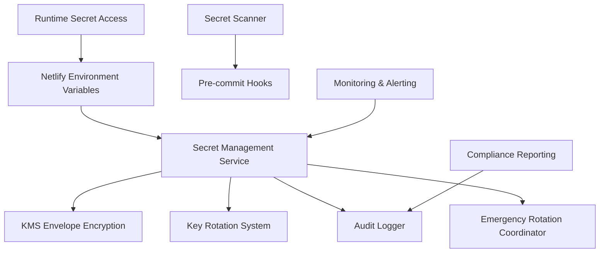

# DCE Platform Secret Management System
**Phase 4.9: Comprehensive Secret Management Implementation**

## Overview

The DCE Platform implements a comprehensive secret management system designed to secure, rotate, and audit all sensitive information used throughout the application. This system provides enterprise-grade security for database credentials, API keys, encryption keys, and other sensitive data.

## Table of Contents

- [Overview](#overview)
- [Architecture](#architecture)
- [Secret Classification](#secret-classification)
- [KMS Envelope Encryption](#kms-envelope-encryption)
- [Automated Key Rotation](#automated-key-rotation)
- [Emergency Rotation Procedures](#emergency-rotation-procedures)
- [Netlify Integration](#netlify-integration)
- [Secret Scanning](#secret-scanning)
- [Audit Logging](#audit-logging)
- [Migration Guide](#migration-guide)
- [Monitoring & Alerting](#monitoring--alerting)
- [Compliance](#compliance)

## Architecture

### Components



### Core Services

1. **SecretManagementService** - Central service for secure storage and retrieval
2. **KMSEnvelopeEncryption** - Encryption using data encryption keys (DEK)
3. **KeyRotationSystem** - Automated rotation with provider integration
4. **EmergencyRotationCoordinator** - Incident response and emergency procedures
5. **NetlifySecretManager** - Integration with Netlify environment variables
6. **SecretScanner** - Prevention of committed secrets
7. **SecretAuditLogger** - Comprehensive audit trail

## Secret Classification

### Sensitivity Levels

| Level | Description | Rotation Interval | Access Control |
|-------|-------------|-------------------|----------------|
| **CRITICAL** | Master keys, payment secrets | 14 days | Production only, admin approval |
| **HIGH** | Database credentials, auth tokens | 30 days | Production + staging, team lead approval |
| **MEDIUM** | External API keys | 90 days | All environments, developer access |
| **LOW** | Configuration values | 365 days | All environments, standard access |

### Secret Categories

| Category | Examples | Special Requirements |
|----------|----------|---------------------|
| **DATABASE** | Supabase URLs, connection strings | Connection testing during rotation |
| **AUTHENTICATION** | JWT secrets, CSRF tokens | Gradual rollout to prevent session invalidation |
| **PAYMENT** | Stripe keys, webhook secrets | Immediate webhook verification |
| **TELEPHONY** | Twilio credentials | Call routing validation |
| **MONITORING** | Sentry DSN, logging tokens | Error reporting continuity |
| **EXTERNAL_API** | Third-party service keys | Rate limit considerations |
| **ENCRYPTION** | Master keys, PII encryption | Key derivation and backup procedures |
| **WEBHOOK** | Signature verification secrets | Endpoint validation |

## KMS Envelope Encryption

### Implementation

The system uses AWS KMS-style envelope encryption with AES-256-GCM:

```typescript
// Example usage
const kms = new KMSEnvelopeEncryption(masterKeyHex)
const encrypted = await kms.encryptSecret(plaintext)
const decrypted = await kms.decryptSecret(encrypted)
```

### Security Features

- **Data Encryption Keys (DEK)**: Unique 256-bit keys for each secret
- **Master Key Protection**: Master key used only for DEK encryption
- **Authentication**: GCM mode provides built-in authentication
- **Key Derivation**: HKDF for additional key material when needed

### Key Hierarchy

```
Master Key (256-bit)
└── Data Encryption Key (256-bit, per secret)
    └── Encrypted Secret Data
```

## Automated Key Rotation

### Rotation Providers

The system includes providers for automatic rotation:

- **SupabaseRotationProvider**: Database credentials
- **StripeRotationProvider**: Payment processing keys
- **JWTRotationProvider**: Authentication secrets
- **GenericAPIKeyRotationProvider**: External service keys

### Rotation Schedule

```typescript
// Check for secrets needing rotation
const needingRotation = await rotationSystem.getSecretsNeedingRotation()

// Rotate all due secrets
const results = await rotationSystem.rotateAllDue()
```

### Scheduling

- **Automated**: Daily checks via `RotationScheduler`
- **Proactive**: 7-day advance warnings
- **Compliance**: Automatic documentation for audits

## Emergency Rotation Procedures

### Emergency Levels

| Level | Response Time | Approval Required | Notification |
|-------|---------------|-------------------|--------------|
| **CRITICAL** | Immediate | CEO/CTO | All channels |
| **HIGH** | 15 minutes | Security Lead | Security team + management |
| **MEDIUM** | 1 hour | Team Lead | Security team |
| **LOW** | 24 hours | Self-approval | Security team notification |

### Incident Types

- **CONFIRMED_BREACH**: Rotate all critical and high sensitivity secrets
- **SUSPECTED_BREACH**: Rotate critical secrets only
- **EMPLOYEE_DEPARTURE**: Rotate access-related secrets
- **VENDOR_COMPROMISE**: Rotate vendor-specific secrets
- **ACCIDENTAL_EXPOSURE**: Rotate exposed secrets

### Emergency Rotation Process

```typescript
const coordinator = new EmergencyRotationCoordinator(secretManager, rotationSystem)

const request: EmergencyRotationRequest = {
  id: `emergency_${Date.now()}`,
  level: EmergencyLevel.HIGH,
  type: IncidentType.CONFIRMED_BREACH,
  reason: "Database credentials compromised in security incident",
  affectedSecrets: ["SUPABASE_SERVICE_ROLE_KEY", "JWT_SECRET"],
  requestedBy: "security-team@dependablecalls.com",
  requestedAt: new Date(),
  urgentBypass: true
}

const results = await coordinator.initiateEmergencyRotation(request)
```

## Netlify Integration

### Environment Variable Management

The DCE platform uses Netlify environment variables for secure secret storage:

```typescript
// Runtime access
const envLoader = NetlifySecretManager.createSecureEnvLoader()
const dbSecrets = RuntimeSecretAccess.getDatabaseSecrets()
```

### Context-Based Configuration

| Context | Secrets Available | Use Case |
|---------|-------------------|----------|
| **production** | All secrets | Live environment |
| **deploy-preview** | High+ sensitivity | PR testing |
| **branch-deploy** | Medium+ sensitivity | Feature testing |

### Migration from .env

Use the migration script to move from local `.env` files:

```bash
./scripts/migrate-secrets.sh
```

This script:
1. Backs up current environment variables
2. Parses `.env.example` for DCE secrets
3. Sets appropriate contexts for each secret
4. Validates migration success
5. Generates post-migration checklist

## Secret Scanning

### Pre-commit Hook

Install the pre-commit hook to prevent secret commits:

```bash
# Install hook
cp scripts/pre-commit-secret-scan.js .git/hooks/pre-commit
chmod +x .git/hooks/pre-commit

# Manual scan
node scripts/pre-commit-secret-scan.js
```

### Scanning Patterns

The scanner detects:
- AWS credentials
- Stripe keys
- JWT tokens
- Database URLs
- Private keys
- Generic API keys
- Hardcoded passwords

### CI/CD Integration

```yaml
# Example GitHub Actions workflow
- name: Scan for secrets
  run: |
    npm run build
    node scripts/pre-commit-secret-scan.js
```

## Audit Logging

### Logged Events

Every secret operation is logged:

```typescript
interface SecretAuditLog {
  id: string
  secretId: string
  action: 'create' | 'read' | 'update' | 'rotate' | 'delete'
  userId: string
  userType: string
  timestamp: Date
  ipAddress: string
  userAgent: string
  source: 'dashboard' | 'api' | 'rotation' | 'emergency'
}
```

### Compliance Features

- **Immutable logs**: Audit entries cannot be modified
- **Retention**: 7-year retention for regulatory compliance
- **Real-time monitoring**: Anomalous access detection
- **Export capabilities**: CSV/JSON export for audits

## Migration Guide

### From .env to Netlify

1. **Audit current secrets**:
   ```bash
   grep -r "process.env\|import.meta.env" src/
   ```

2. **Run migration script**:
   ```bash
   ./scripts/migrate-secrets.sh
   ```

3. **Verify migration**:
   ```bash
   netlify env:list
   ```

4. **Update application code**:
   ```typescript
   // Before
   const apiKey = process.env.STRIPE_SECRET_KEY

   // After
   const apiKey = RuntimeSecretAccess.getPaymentSecrets().stripeSecretKey
   ```

5. **Remove .env files**:
   ```bash
   rm .env .env.local .env.production
   git add -A && git commit -m "Remove .env files after migration"
   ```

### Testing Migration

1. **Staging deployment**: Test with deploy preview
2. **Integration tests**: Verify all services work
3. **Rollback plan**: Keep backup of original configuration

## Monitoring & Alerting

### Key Metrics

- **Secret access frequency**: Unusual access patterns
- **Failed rotation attempts**: Provider issues or network problems
- **Rotation compliance**: Overdue secrets requiring attention
- **Emergency rotations**: Security incident response times

### Alert Channels

| Channel | Urgency | Configuration |
|---------|---------|---------------|
| **Slack** | Medium+ | `#security-alerts` |
| **Email** | High+ | `security@dependablecalls.com` |
| **PagerDuty** | Critical | `security-team` escalation |

### Dashboard Metrics

```typescript
// Example monitoring dashboard
const metrics = {
  secretsTotal: Object.keys(SECRET_INVENTORY).length,
  secretsOverdue: await rotationSystem.getSecretsNeedingRotation(),
  rotationsThisMonth: rotationHistory.filter(isThisMonth).length,
  emergencyRotations: emergencyHistory.filter(isThisMonth).length
}
```

## Compliance

### Regulatory Requirements

- **GDPR**: PII encryption and data protection
- **PCI DSS**: Payment data security standards
- **SOC 2**: Security controls and monitoring
- **CCPA**: California consumer privacy compliance

### Audit Support

- **Immutable logs**: Comprehensive audit trail
- **Access controls**: Role-based permissions
- **Encryption standards**: AES-256 with proper key management
- **Rotation policies**: Automated compliance with security policies

### Documentation

- **Policies**: Secret management policies and procedures
- **Procedures**: Step-by-step operational procedures
- **Training**: Security awareness and incident response training
- **Evidence**: Automated compliance reporting and evidence collection

## API Reference

### SecretManagementService

```typescript
// Store encrypted secret
await secretManager.storeSecret(
  secretId: string,
  value: string,
  metadata: Partial<SecretMetadata>,
  userId: string,
  userType: string,
  context: AuditContext
)

// Retrieve decrypted secret
const secret = await secretManager.getSecret(
  secretId: string,
  userId: string,
  userType: string,
  context: AuditContext
)

// Rotate secret
await secretManager.rotateSecret(
  secretId: string,
  newValue: string,
  userId: string,
  userType: string,
  context: AuditContext
)
```

### KeyRotationSystem

```typescript
// Get rotation schedule
const schedule = await rotationSystem.getRotationSchedule()

// Rotate specific secret
const result = await rotationSystem.rotateSecret(secretId, userId, userType)

// Emergency rotation
const results = await rotationSystem.emergencyRotation(
  secretId,
  reason,
  userId,
  userType
)
```

### NetlifySecretManager

```typescript
// Runtime secret access
const dbSecrets = RuntimeSecretAccess.getDatabaseSecrets()
const paymentSecrets = RuntimeSecretAccess.getPaymentSecrets()
const authSecrets = RuntimeSecretAccess.getAuthSecrets()

// Environment validation
const envLoader = NetlifySecretManager.createSecureEnvLoader()
envLoader.validateSecrets(['SUPABASE_URL', 'STRIPE_SECRET_KEY'])
```

## Troubleshooting

### Common Issues

1. **Missing secrets in environment**:
   - Check Netlify dashboard environment variables
   - Verify correct context (production/deploy-preview/branch-deploy)
   - Run migration script if migrating from .env

2. **Failed rotation**:
   - Check provider API credentials
   - Verify network connectivity
   - Review audit logs for detailed error messages

3. **Pre-commit hook blocking valid code**:
   - Review detected patterns for false positives
   - Add exclusions to scanner configuration
   - Use `git commit --no-verify` only if absolutely necessary

### Support

- **Security Team**: security@dependablecalls.com
- **DevOps Team**: devops@dependablecalls.com
- **Documentation**: `/docs/security/`
- **Incident Response**: Follow emergency rotation procedures

## Best Practices

### Development

1. **Never commit secrets**: Use pre-commit hooks and secret scanning
2. **Use environment variables**: Access secrets through secure runtime methods
3. **Rotate regularly**: Follow automated rotation schedules
4. **Audit access**: Monitor secret access patterns

### Operations

1. **Monitor expiration**: Set up alerts for upcoming rotations
2. **Test rotations**: Verify rotation procedures in staging
3. **Document incidents**: Maintain comprehensive incident records
4. **Train team**: Regular security awareness training

### Security

1. **Principle of least privilege**: Limit secret access by role
2. **Defense in depth**: Multiple layers of protection
3. **Regular audits**: Periodic security assessments
4. **Incident response**: Maintain emergency procedures

---

*This document is maintained by the DCE Security Team. Last updated: Phase 4.9 Implementation*